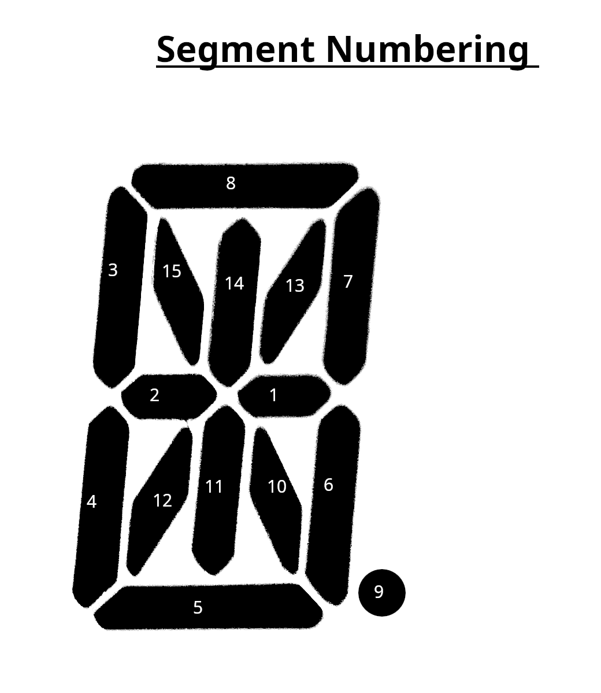

# README
In its current iteration, this is pretty rough, but it should provide enough functionality for basic animations.  

Before using, make sure you have circuit python installed.  
Currently, this only works for 14x4 displays.  

Basic Usage:  
Create a two dimensional list. Each nested list will contain the two bytes to control which semgments are lit up, and the grid number they will be displayed on.

See code.py for examples and further explanations.